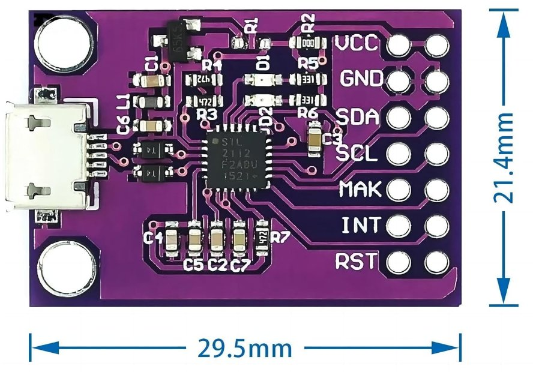
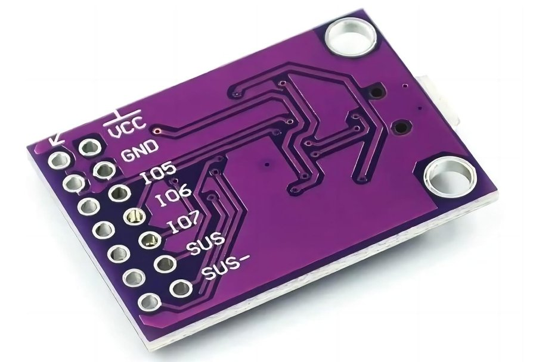
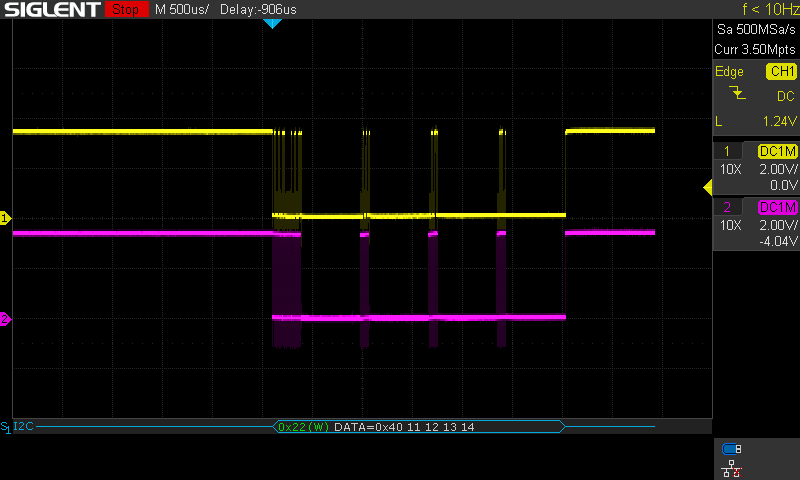
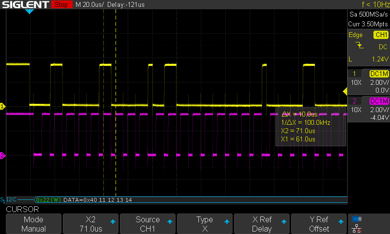
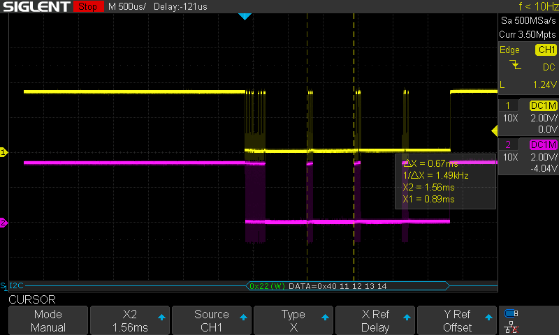
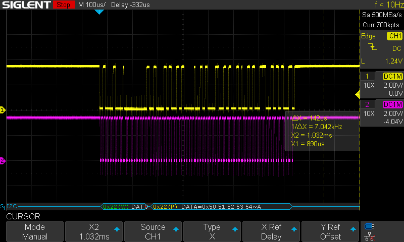
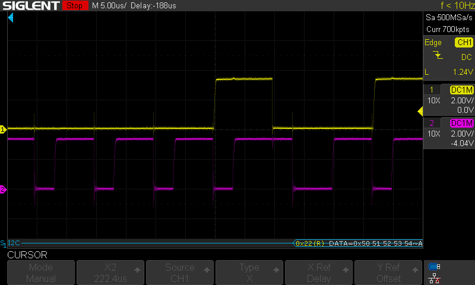
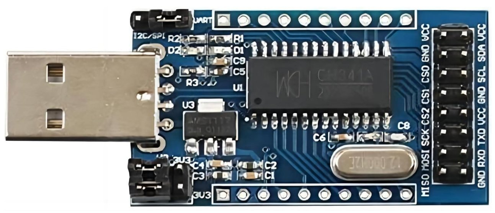
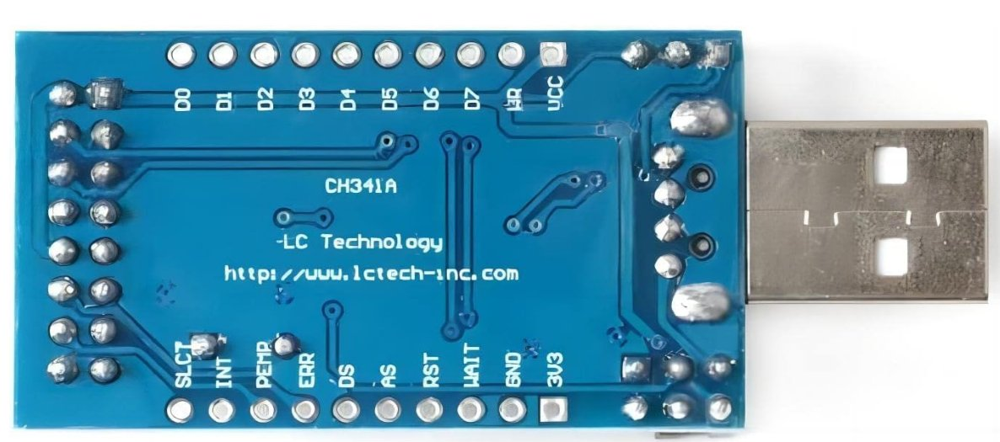

# usb-i2c-adapters

Here is a review of some USB to I2C adapters.  These allow you to access I2C
devices via USB by using Linux's /dev/i2c device driver.  I used one to
develop a firmware updater application for an I2C accessible FPGA on my
laptop instead of on the target Linux embedded system.

Ubuntu version: Ubuntu 22.04.4 LTS

Kernel version: 6.8.0-52-generic

## Silicon Labs CP2112

Chip: [cp2112 Datasheet](https://www.silabs.com/documents/public/data-sheets/cp2112-datasheet.pdf)

Board: Search Amazon for this description:
"WWZMDiB CP2112 Adapter Micro USB to SMBus I2C Communication with Wires"

USB: Micro USB socket, 12 M

Board price: $10

Pull ups: 4.7K on SDA and SCL on the board (find R3 and R4 in board photo
above)

Voltage: 3.3 V, but board also supports 1.8V: Move 0-ohm jumper from R2 to
R1.

Driver: it's built into Linux

SCL frequency: 100 KHz only (driver doesn't seem to support changing it)

Performance:

Write: 1379 BPS with 29 byte packets

Read: 4433 BPS

Waveforms:

Five byte write:

Zoomed in, you can see the 100 MHz:

Note the large gap between bytes:

Five byte read:

Note repeated start condition during the above read (SDA fall while SCL is
high):

dmesg on insertion:

~~~
[794148.928023] usb 3-7: New USB device found, idVendor=10c4, idProduct=ea90, bcdDevice= 0.00
[794148.928044] usb 3-7: New USB device strings: Mfr=1, Product=2, SerialNumber=3
[794148.928050] usb 3-7: Product: CP2112 HID USB-to-SMBus Bridge
[794148.928054] usb 3-7: Manufacturer: Silicon Laboratories
[794148.928057] usb 3-7: SerialNumber: 0057463B
[794148.932925] cp2112 0003:10C4:EA90.0019: hidraw0: USB HID v1.01 Device [Silicon Laboratories CP2112 HID USB-to-SMBus Bridge] on usb-0000:00:14.0-7/input0
[794148.984858] cp2112 0003:10C4:EA90.0019: Part Number: 0x0C Device Version: 0x02
~~~

i2cdetect -l:

~~~
i2c-16	unknown   	CP2112 SMBus Bridge on hidraw0  	N/A
~~~

lsmod:

~~~
hid_cp2112             40960  0
~~~

lsusb -v:

~~~
Bus 003 Device 052: ID 10c4:ea90 Silicon Labs CP2112 HID I2C Bridge
Device Descriptor:
  bLength                18
  bDescriptorType         1
  bcdUSB               1.10
  bDeviceClass            0 
  bDeviceSubClass         0 
  bDeviceProtocol         0 
  bMaxPacketSize0        64
  idVendor           0x10c4 Silicon Labs
  idProduct          0xea90 CP2112 HID I2C Bridge
  bcdDevice            0.00
  iManufacturer           1 Silicon Laboratories
  iProduct                2 CP2112 HID USB-to-SMBus Bridge
  iSerial                 3 0057463B
  bNumConfigurations      1
  Configuration Descriptor:
    bLength                 9
    bDescriptorType         2
    wTotalLength       0x0029
    bNumInterfaces          1
    bConfigurationValue     1
    iConfiguration          0 
    bmAttributes         0x80
      (Bus Powered)
    MaxPower              100mA
    Interface Descriptor:
      bLength                 9
      bDescriptorType         4
      bInterfaceNumber        0
      bAlternateSetting       0
      bNumEndpoints           2
      bInterfaceClass         3 Human Interface Device
      bInterfaceSubClass      0 
      bInterfaceProtocol      0 
      iInterface              0 
        HID Device Descriptor:
          bLength                 9
          bDescriptorType        33
          bcdHID               1.01
          bCountryCode            0 Not supported
          bNumDescriptors         1
          bDescriptorType        34 Report
          wDescriptorLength     258
         Report Descriptors: 
           ** UNAVAILABLE **
      Endpoint Descriptor:
        bLength                 7
        bDescriptorType         5
        bEndpointAddress     0x81  EP 1 IN
        bmAttributes            3
          Transfer Type            Interrupt
          Synch Type               None
          Usage Type               Data
        wMaxPacketSize     0x0040  1x 64 bytes
        bInterval               1
      Endpoint Descriptor:
        bLength                 7
        bDescriptorType         5
        bEndpointAddress     0x01  EP 1 OUT
        bmAttributes            3
          Transfer Type            Interrupt
          Synch Type               None
          Usage Type               Data
        wMaxPacketSize     0x0040  1x 64 bytes
        bInterval               1
Device Status:     0x0000
  (Bus Powered)
~~~

## ft260

Chip: [FT260 Datasheet](https://www.ftdichip.com/Support/Documents/DataSheets/ICs/DS_FT260.pdf)

Board: [UMFT260EV1A](https://www.mouser.com/datasheet/2/163/DS_UMFT260EV1A-957841.pdf)

Board price: $15

Pull ups: 1K on SDA and SCL on the board

Voltage: 3.3 V, but board also supports external supply of 1.8V - 3.3V
(remove JP1 for this)

Driver: it's built into Linux

SCL frequency: 100 KHz only (driver doesn't seem to support changing it)

Performance:

Write: 1427 BPS with 16 byte packets

Read: 4426 BPS with 40 byte packets

Waveforms:

Lsusb:

~~~
Bus 003 Device 053: ID 0403:6030 Future Technology Devices International, Ltd FT260
Device Descriptor:
  bLength                18
  bDescriptorType         1
  bcdUSB               2.00
  bDeviceClass            0 
  bDeviceSubClass         0 
  bDeviceProtocol         0 
  bMaxPacketSize0        64
  idVendor           0x0403 Future Technology Devices International, Ltd
  idProduct          0x6030 
  bcdDevice           22.00
  iManufacturer           1 FTDI
  iProduct                2 FT260
  iSerial                 0 
  bNumConfigurations      1
  Configuration Descriptor:
    bLength                 9
    bDescriptorType         2
    wTotalLength       0x0049
    bNumInterfaces          2
    bConfigurationValue     1
    iConfiguration          0 
    bmAttributes         0xa0
      (Bus Powered)
      Remote Wakeup
    MaxPower              100mA
    Interface Descriptor:
      bLength                 9
      bDescriptorType         4
      bInterfaceNumber        0
      bAlternateSetting       0
      bNumEndpoints           2
      bInterfaceClass         3 Human Interface Device
      bInterfaceSubClass      0 
      bInterfaceProtocol      0 
      iInterface              0 
        HID Device Descriptor:
          bLength                 9
          bDescriptorType        33
          bcdHID               1.11
          bCountryCode            0 Not supported
          bNumDescriptors         1
          bDescriptorType        34 Report
          wDescriptorLength     279
         Report Descriptors: 
           ** UNAVAILABLE **
      Endpoint Descriptor:
        bLength                 7
        bDescriptorType         5
        bEndpointAddress     0x81  EP 1 IN
        bmAttributes            3
          Transfer Type            Interrupt
          Synch Type               None
          Usage Type               Data
        wMaxPacketSize     0x0040  1x 64 bytes
        bInterval               1
      Endpoint Descriptor:
        bLength                 7
        bDescriptorType         5
        bEndpointAddress     0x02  EP 2 OUT
        bmAttributes            3
          Transfer Type            Interrupt
          Synch Type               None
          Usage Type               Data
        wMaxPacketSize     0x0040  1x 64 bytes
        bInterval               1
    Interface Descriptor:
      bLength                 9
      bDescriptorType         4
      bInterfaceNumber        1
      bAlternateSetting       0
      bNumEndpoints           2
      bInterfaceClass         3 Human Interface Device
      bInterfaceSubClass      0 
      bInterfaceProtocol      0 
      iInterface              0 
        HID Device Descriptor:
          bLength                 9
          bDescriptorType        33
          bcdHID               1.11
          bCountryCode            0 Not supported
          bNumDescriptors         1
          bDescriptorType        34 Report
          wDescriptorLength     279
         Report Descriptors: 
           ** UNAVAILABLE **
      Endpoint Descriptor:
        bLength                 7
        bDescriptorType         5
        bEndpointAddress     0x83  EP 3 IN
        bmAttributes            3
          Transfer Type            Interrupt
          Synch Type               None
          Usage Type               Data
        wMaxPacketSize     0x0040  1x 64 bytes
        bInterval               1
      Endpoint Descriptor:
        bLength                 7
        bDescriptorType         5
        bEndpointAddress     0x04  EP 4 OUT
        bmAttributes            3
          Transfer Type            Interrupt
          Synch Type               None
          Usage Type               Data
        wMaxPacketSize     0x0040  1x 64 bytes
        bInterval               1
Device Status:     0x0000
  (Bus Powered)
~~~

## ch341

Chip:

Board: Amazon description "WWZMDiB CH341A USB to UART/IIC/SPI/TTL/ISP Adapter EPP/MEM Parallel Converter"

USB: Micro USB socket, 12 M

Board price: $8

Driver: Not included in Linux, get it here.  It's easy to compile.

[https://github.com/frank-zago/ch341-i2c-spi-gpio](https://github.com/frank-zago/ch341-i2c-spi-gpio)

Performance:

Write:

Read: 15725 BPS
